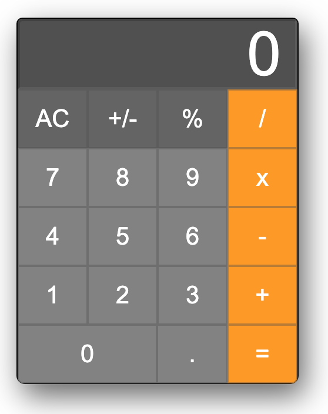

# Basic Calulator

## Deployment
 - [Link](https://congmul.github.io/tutoring-calculator/)

## Table of Contents
- [About](#About)
- [User Story](#User-Story)
- [Usage](#Usage)
- [Getting Started](#Getting-Started)
- [Contributing](#Contributing)
- [Questions](#Questions)

## About
 - This is a basic calculator.
 - 
## User Story
```
AS a user
    I WANT to see the result of calculating between two numbers.
    SO THAT I can calculate two numbers by Plus, Minus, Times, Division, or Mode.
```

## Technologies
 - HTML, CSS, JS, REGEX

## Usage

## Getting Started

## Contributing